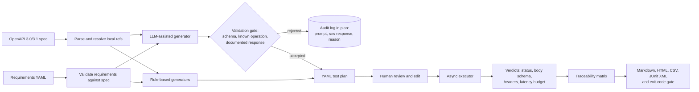

# api-vv-toolkit

[](https://github.com/muhib-karim/api-vv-toolkit/actions/workflows/ci.yml)
[](https://github.com/muhib-karim/api-vv-toolkit/releases)


[](https://muhib-karim.github.io/api-vv-toolkit/)

api-vv-toolkit reads an OpenAPI contract and a list of written requirements. It generates API
tests from them, runs the tests against a live service and reports which requirements are
verified, which failed and which have no test at all. Every test records the requirement it
checks, so a failure points back to what the service was supposed to do.

**Live demo:** [the HTML traceability report](https://muhib-karim.github.io/api-vv-toolkit/) from the
seeded-defect demo below, rebuilt by CI from `main` on every push
([CSV matrix](https://muhib-karim.github.io/api-vv-toolkit/traceability.csv),
[JUnit XML](https://muhib-karim.github.io/api-vv-toolkit/junit.xml)).

An optional LLM step can suggest extra test scenarios. Its suggestions are checked against the
spec before they enter the plan, and the prompt, raw reply and accept/reject reason are stored
with the plan so a reviewer can see why each one was kept or dropped.

## The problem

API test suites and requirements are usually written by different people at different times,
and they drift apart. Tests get added for bugs and removed when they are flaky. Requirements get
reworded. After a few releases nobody can say which requirement a test protects, or whether a
given requirement is tested at all. A green CI run then shows that the tests passed. It does not
show that the requirements were met.

Regulated and safety-conscious teams (medical, automotive, finance, public sector) are asked for
this evidence directly. An auditor wants a requirements traceability matrix: for each
requirement, the tests that verify it and the latest result of each. Keeping that matrix by hand
in a spreadsheet is slow and goes out of date quickly.

This tool derives the matrix from the same data the tests run from, so it cannot drift from them:

- trace links come from structural selectors in the requirements file (operation, response code,
  check type), not from test names;
- a requirement counts as verified only when a passing test covers every response and check it
  names. Having a generated test is not enough;
- the run fails (non-zero exit code) when a must-priority requirement is failed, partially
  covered or not covered. Which priorities and statuses fail the run is configurable.

## How it works



1. **Parse.** The OpenAPI document is loaded into typed pydantic models (operations, parameters,
   request bodies, response schemas and headers, security schemes). Local `$ref`s are resolved.
   Remote refs, recursive refs and unsupported parameter styles are rejected with a clear error
   instead of being skipped.
2. **Generate.** Rule-based generators produce deterministic cases:

   | Generator | What it produces |
   | --- | --- |
   | `happy-path` | a valid request built from schema examples, defaults and constraints |
   | `schema-boundary` | min/max length, minimum/maximum, item counts (below, at, above each bound), out-of-enum values, wrong types, omitted required fields, unexpected properties when `additionalProperties: false` |
   | `parameter-boundary` | the same rules applied to path, query, header and cookie parameters |
   | `required-omission` | a missing required body or parameter |
   | `auth-required` | the request with credentials removed, expecting the documented 401/403 |
   | `status-coverage` | a disabled review case for each documented response no generator reached |

   Cases are deduplicated by a fingerprint of the request, and the fingerprint becomes the case
   id (`TC-fcf6e146d3f7`), so ids stay the same across regenerations.
3. **Review.** The plan is plain YAML. A reviewer can disable a case, change an expected status
   or fill in a review case before running it. Edits are re-validated when the plan is run.
4. **Execute.** httpx sends the requests asynchronously with a concurrency limit and timeouts.
   Retries are off by default and apply only to transport errors on GET/HEAD/OPTIONS. Each
   response is checked against the expected status, the JSON Schema of the documented body
   (using the jsonschema library), documented headers and any latency budget on the requirement.
5. **Report.** The traceability matrix lists requirement, tests and latest verdicts, plus tests that
   trace to no requirement and operations that no requirement covers. It is written as
   Markdown, self-contained HTML (inline CSS, no scripts or external assets), CSV for
   spreadsheet workflows and JUnit XML for CI systems.

## Quickstart

Requires Python 3.11 or newer.

```bash
python3 -m venv .venv
.venv/bin/pip install -e '.[dev,demo]'
make demo
```

With your own API:

```bash
api-vv validate-requirements --spec openapi.yaml --requirements requirements.yaml
api-vv generate --spec openapi.yaml --requirements requirements.yaml --out plan.yaml
# review and edit plan.yaml
api-vv run --plan plan.yaml --base-url http://localhost:8000 --config config.yaml --out results.yaml
api-vv report --plan plan.yaml --results results.yaml --out-dir reports/
api-vv trace --plan plan.yaml --results results.yaml --format csv --out matrix.csv
```

Exit codes: `0` gate passed, `1` gate failed, `2` invalid input.

A requirement names the operations and responses it covers. The optional `checks` list narrows
the match to specific generated checks:

```yaml
requirements:
  - id: REQ-003
    text: A widget name longer than eight characters is rejected.
    priority: must            # must | should | could
    verification_method: test # test | demonstration | inspection | analysis
    covers:
      - operation_id: createWidget
        responses: ['422']
        checks: ['boundary:name:maxLength:above']
  - id: REQ-012
    text: The health endpoint responds within one second in this local demo.
    priority: should
    verification_method: test
    latency_ms: 1000
    covers: [{operation_id: health, responses: ['200'], checks: [happy-path]}]
```

Requirements verified by `inspection` or `analysis` stay in the matrix but never get
generated tests. They show as not covered, which is accurate.

The config file sets concurrency, timeouts, retries, the gate, the LLM provider and the names of
environment variables that hold credentials (`credentials_env: {DemoKey: API_VV_DEMO_KEY}`).
Secrets themselves never appear in config, plans, results or reports.


### Install a release build

Every tagged release carries a wheel, an sdist and `SHA256SUMS.txt`, built and tested by the [release workflow](.github/workflows/release.yml):

```sh
pip install https://github.com/muhib-karim/api-vv-toolkit/releases/download/v1.1.0/api_vv_toolkit-1.1.0-py3-none-any.whl
```

Check the file against `SHA256SUMS.txt` on the [Releases page](https://github.com/muhib-karim/api-vv-toolkit/releases/latest).

## Demo: two seeded defects

`examples/demo_api/` is a small Starlette service with an OpenAPI 3.1 contract, twelve
requirements and two deliberate bugs, described in
[its README](examples/demo_api/README.md):

1. the name length check allows 9 characters where the contract says 8;
2. `DELETE /widgets/{widget_id}` returns 200 where the contract says 204.

`make demo` starts the service on a loopback port, runs the CLI end to end and writes everything
to `runs/demo/`. Output from a run:

```text
$ make demo
.venv/bin/python scripts/demo.py
Validated 12 requirements
Generated 31 cases (31 enabled)
LLM proposals: 1 accepted, 1 rejected
Executed: 29 passed, 2 failed, 0 skipped
Gate: FAIL (REQ-003, REQ-008)
Wrote Markdown, HTML, CSV and JUnit reports to runs/demo
Gate: FAIL (REQ-003, REQ-008)
Expected defects confirmed: REQ-003, REQ-008
```

The gate prints twice because both `run` and `report` apply it. The last line comes from the
demo script, which exits non-zero unless exactly those two requirements fail. The CI demo job
relies on this.

Excerpt from the generated matrix ([full report](docs/sample-report.md),
[CSV](docs/sample-traceability.csv)):

| Requirement | Priority | Status | Test cases → latest verdict |
| --- | --- | --- | --- |
| REQ-002: A valid widget can be created. | must | verified | TC-49e39d3e97cf → passed |
| REQ-003: A widget name longer than eight characters is rejected. | must | failed | TC-fcf6e146d3f7 → failed |
| REQ-007: The secure endpoint rejects unauthenticated requests. | must | verified | TC-bc42e8332169 → passed |
| REQ-008: Deleting a widget returns 204 with no body. | must | failed | TC-13777f5b2f2f → failed |
| REQ-010: Reading absent widget 999 returns a documented not-found response. | must | verified | TC-bf3867a1d253 → passed |

```text
## Execution findings

- TC-fcf6e146d3f7 (failed): status: expected 422, got 201
- TC-13777f5b2f2f (failed): status: expected 204, got 200; response status is undocumented
```

The failing REQ-003 case, as it appears in the plan:

```yaml
- id: TC-fcf6e146d3f7
  name: 'createWidget: boundary:name:maxLength:above'
  operation_id: createWidget
  body: {name: xxxxxxxxx, role: reader, age: 30}
  has_body: true
  expected_status: '422'
  negative: true
  generators: [schema-boundary]
  checks: [boundary:name:maxLength:above]
  requirement_ids: [REQ-003]
```

The matrix also lists 20 untraced tests: boundary and type checks that ran but that no
requirement claims. They are shown so a reviewer can decide whether a requirement is missing
or the tests are unnecessary.

## Keeping the LLM path honest

The LLM generator is optional and off unless `--llm` is passed. It is treated as a source of
suggestions that must be checked, not as a trusted author.

- **Schema-constrained output.** The model must return JSON matching a fixed schema
  (`proposals[]` with operation, parameters, body, expected status and a `negative` flag). OpenAI-compatible
  endpoints get it as `response_format: json_schema`, Anthropic as a forced tool call.
  Temperature is 0.
- **Spec validation gate.** Each proposal must name a known operation, use only declared
  parameters with schema-valid values, expect a documented response, stay within the requirement
  it was asked about, and mark any schema-invalid body as `negative: true`. Proposals that
  contradict an existing case's expectation for the same request are rejected.
- **Recorded provenance.** For every requirement the plan stores the prompt, the raw response
  and one review entry per proposal. From the demo plan:

  ```yaml
  requirement_id: REQ-010
  provider: mock
  reviews:
  - index: 0
    accepted: true
    reason: validated
    case_id: TC-bf3867a1d253
  - index: 1
    accepted: false
    reason: unknown operation; proposal is outside the requested requirement coverage
    case_id: null
  ```

- **Never auto-trusted.** Accepted proposals land in the same reviewable plan as rule-based cases
  and are tagged `generators: [llm]`. A requirement is only traced to an LLM case if its selectors
  explicitly allow `llm-scenario` checks, so a model cannot claim coverage of a requirement it
  was not scoped to.
- **Secrets.** Base URL and API key come from environment variables named in the config. They
  are not logged, and provider errors are reduced to the exception type so response bodies and
  headers are not echoed.
- **Offline by default.** The `mock` provider replays hand-written fixtures
  (`examples/demo_api/mock_responses.yaml`). Tests, CI and the demo make no model calls, and the
  test suite blocks sockets entirely.

## Design decisions

- **Plan as a file, not an in-memory step.** Generation and execution are separate commands with
  a YAML file between them. That file is what a reviewer reads, edits and signs off. Results
  carry a digest of the plan they ran, and reports refuse results from a different plan.
- **Structural trace links.** Requirements select tests by operation, response and check type.
  Renaming a test cannot break traceability, and the executor rejects a plan whose stored
  links disagree with the selectors.
- **Evidence-based status.** `verified` needs a passing test for every covered response and
  check. Any failure makes the requirement `failed`. Passing tests that leave some response or
  check uncovered give `partially covered`, and no passing test gives `not covered`.
- **Review cases instead of guesses.** When no generator can produce a trustworthy expectation
  (for example, an invalid input on an operation with no documented 4xx response), the tool writes
  a disabled case with a `review_reason` instead of inventing a status code.
- **Fail loudly on unsupported input.** Remote refs, recursive refs, non-JSON request bodies and
  non-scalar parameters raise errors at parse time instead of producing incomplete plans.
- **Five runtime dependencies**: pydantic, PyYAML, httpx, jsonschema and jinja2. There are no
  provider SDKs: each LLM adapter is a single httpx POST.

## Limitations

- OpenAPI support is a subset: JSON request bodies, scalar parameters with `form`/`simple`
  style, local refs only. XML and multipart request bodies and `deepObject` parameters are
  rejected. Callbacks, webhooks and links are ignored.
- Generated requests are stateless. There is no setup/teardown or chaining (for example, create
  then read the created id). Stateful flows are written as edited or hand-added plan cases.
- Value synthesis handles common JSON Schema keywords and formats. Complex `oneOf`/`anyOf` bodies
  may need an authored example.
- Response bodies are read fully into memory, and schema `pattern`s from the spec run
  as-is, so point it at specs and services you trust.
- The OpenAI and Anthropic adapters are tested against mocked HTTP responses, not live endpoints.

## Roadmap

- Stateful sequences (create, read, delete) with values extracted from earlier responses.
- Requirement import from CSV and ReqIF.
- Diff reports between two runs of the same plan.
- Property-based value generation for bodies without examples.

## Development

```bash
make lint       # ruff check, ruff format --check
make typecheck  # mypy --strict src
make test       # pytest with coverage (fails under 85%)
make demo
```

Tests use [pytest](https://docs.pytest.org/). The executor tests run the demo app in-process
through `httpx.ASGITransport`. The architecture diagram uses [Mermaid](https://mermaid.js.org/).
The [OpenAPI Specification](https://spec.openapis.org/oas/latest.html) defines the input format.

See [CONTRIBUTING.md](CONTRIBUTING.md), [SECURITY.md](SECURITY.md) and [CHANGELOG.md](CHANGELOG.md).
Licensed under the MIT License.
